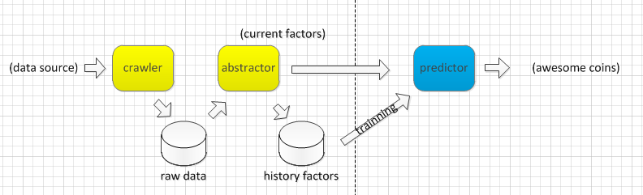

# COIN SEER

## 目标

本项目对数字货币的价格进行预测.

具体来说，是：找出未来一周内可能涨30%的数字货币.

seer = 先知 + 幻想家，成功则是先知，失败则是一场幻想。

## 架构

- **crawler**: 从数据源爬数据得到简单处理的原始数据，数据源有哪些见下文。python的scrapy是个漂亮的爬虫框架，我用过，可以满足需求。原始数据存储随便用什么，但考虑到mongoDB可以比较好地支持不同结构的数据，且scrapy对它的支持比较好，因此拟用mongoDB来存。

- **abstractor**: 从原始数据中抽取价格的影响因素。可以是简单提取如价格、交易量等数据，也可能是对大量文本进行自然语言分析。可以先从重要且简单的因素开始。抽出来的影响因素要积累下来，作为预测器的训练数据。这点非常有利，因为过去的数据是天然的训练集。

- **predictor**: 预测价格。根据训练的结果，输入当前因素，得到未来可能涨的币种。
                                                                    

## 数据源 => 因素

### 交易所 => 价格 交易量 等

- [poloniex](https://poloniex.com/)
- [bittrex](https://bittrex.com/)
- [Kraken](www.kraken.com)
- [Bitfinex](www.bitfinex.com)
- [云币网](https://yunbi.com/)
- [okcoin](https://www.okcoin.cn/)
- [火币网](https://www.huobi.com/)
- [more](http://coinmarketcap.com/currencies/bitcoin/#markets)

### 数字币列表

- [coinmarketcap](http://coinmarketcap.com/all/views/all/)

### 社区 => 关注度 贴数

- [bitcointalk](https://bitcointalk.org/)
- [bitcoin forum](https://forum.bitcoin.com/)

- [ethereum forum](https://forum.ethereum.org/)

- [xrpchat](http://www.xrpchat.com/)

- [litecointalk](https://litecointalk.org/)
- [litecoin annoucement](https://bitcointalk.org/index.php?topic=47417.0)

- [Monero forum](https://forum.getmonero.org/)
- [Monero annoucement](https://bitcointalk.org/index.php?topic=583449.0)

- [etc annoucement](https://bitcointalk.org/index.php?topic=1559630.0)

- [dash forum](https://www.dash.org/forum/)
- [dash annoucement](https://bitcointalk.org/index.php?topic=421615.0)

- [MaidSafeCoin forum](https://safenetforum.org/)
- [MaidSafeCoin annoucement](https://bitcointalk.org/index.php?topic=579797.0)

- [more](http://coinmarketcap.com/all/views/all/)

### 网络媒体 => 曝光率

- [巴比特](http://www.8btc.com/)

- 开发团队 => 团队实力 开发活跃度

- 搜索引擎 => google趋势指数 结果数

- 社交网络 => 关注度

所有这些都需要存量和增量。

## 难点

- 找到合适的影响因素

- 建立可行的预测模型

## TO DO

- 了解主流预测模型有哪些
- 谁有兴趣参与

